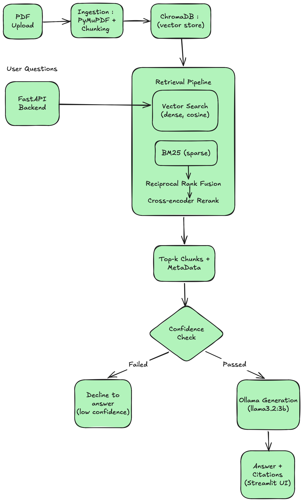

# SPPU Syllabus QA — Local RAG System

A fully local, retrieval-augmented question-answering system for Pune University syllabus PDFs. Upload a syllabus, ask natural-language questions, get cited answers — with no external LLM APIs, no cloud vector database, and no per-query cost.

I built this to explore and understand production RAG systems: retrieval quality measurement, hybrid search, reranking, structured extraction, and honest evaluation of what actually works.

All the documents that I used for this project can be found at [sources](https://www.unipune.ac.in/university_files/syllabi.htm)   

---

## Overview

Most RAG tutorials and blogs I came across stop at "upload a PDF, ask a question, get an answer." This project goes a step further: it treats retrieval and generation as things that need to be **measured**, not just built. The core of the project isn't the chat UI — it's the evaluation harness that analyzes whether each technique (hybrid search, reranking, confidence thresholding) actually improves the system, rather than assuming it does.

Everything runs locally: embeddings via Gemini's API (free tier) for ingestion/retrieval, and **Ollama** running `llama3.2:3b` (chat) and `qwen2.5:7b-instruct` (structured extraction) for generation — no OpenAI/Anthropic API dependency for the generation step, and no rate limits during development.

---

## Key Results

### Retrieval Evaluation (Recall@5, MRR)

| Method | Recall@5 | MRR |
|---|---|---|
| Vector-only (dense embeddings) | 100% | 0.969 |
| Hybrid (Vector + BM25 via Reciprocal Rank Fusion) | 100% | **1.000** |
| Hybrid + Cross-Encoder Reranking | 100% | 0.969 |

### Generation / Faithfulness Evaluation

| Metric | Value |
|---|---|
| Answerable question pass rate | 93.75% |
| Refusal accuracy (correctly declines out-of-scope questions) | 100% |
| Avg. keyword match ratio (faithfulness proxy) | 83.33% |

**Important caveat:** these numbers were measured on a single-document corpus (~16 chunks), where retrieval is close to a solved problem — there's little room for techniques like hybrid search or reranking to show their real value, since there are few plausible "distractor" chunks to disambiguate between. Recall@5 is saturated at 100% in every configuration. The honest takeaways from this baseline are:

- **Hybrid search's MRR gain is real, if small** — it correctly promoted a chunk containing an exact numeric match (marks allocation) from rank 2 to rank 1, which is exactly the failure mode BM25 is meant to catch in dense-only search.
- **Reranking's slight MRR regression is also real and explainable** — the cross-encoder used (`ms-marco-MiniLM-L-6-v2`) is a general-purpose model with no domain fine-tuning, and on this small corpus it occasionally deprioritized a chunk that BM25's exact-match signal had already ranked correctly. This is a known, legitimate limitation of off-the-shelf rerankers, not a bug.
- A true test of these techniques requires a larger, multi-document corpus with genuine topical overlap between documents — this is the top item in **Future Improvements**.

---

## Architecture

   

**Pipeline stages:**
1. **Ingestion**: PDF → page-tracked text extraction (PyMuPDF) → fixed-size chunking → Gemini embeddings → ChromaDB (with filename, page number, chunk index metadata)
2. **Retrieval**: Query → dense vector search (top-N) + BM25 keyword search (top-N) → fused via Reciprocal Rank Fusion → optionally reranked by a cross-encoder → top-K chunks returned
3. **Confidence check**: If the best match's distance exceeds a threshold, the system declines to answer rather than risk hallucination
4. **Generation**: Retrieved chunks + question → prompt → local LLM (Ollama) → answer with page-level source citations
5. **Structured extraction** (separate pipeline): Query is retrieval-augmented with fixed domain terms (teaching scheme, credits, exam pattern) → LLM asked for schema-constrained JSON → validated against a Pydantic model → automatic retry-with-error-feedback on validation failure

---

## Tech Stack

| Component | Choice | Why |
|---|---|---|
| Embeddings | Gemini `gemini-embedding-001` (free tier) | No cost during development; swappable later |
| Chat LLM | Ollama — `llama3.2:3b` (local) | No rate limits, no per-token cost, fully offline after model pull |
| Extraction LLM | Ollama — `qwen2.5:7b-instruct` (local) | Better instruction-following / schema adherence than 3B for structured output — a deliberate model choice per task, not a single default |
| Vector store | ChromaDB (local, persistent) | Zero infrastructure, file-based, good enough at this scale |
| Sparse search | `rank_bm25` (BM25Okapi) | Classic, fast, complements dense embeddings for exact-match terms (course codes, numbers) |
| Fusion | Reciprocal Rank Fusion (custom implementation) | Scale-independent way to combine dense + sparse rankings without needing to normalize incompatible score scales |
| Reranking | `cross-encoder/ms-marco-MiniLM-L-6-v2` (sentence-transformers) | Small, CPU-friendly cross-encoder for a two-stage retrieve-then-rerank pipeline |
| Structured extraction | Pydantic v2 | Schema definition + validation + automatic type coercion |
| Backend | FastAPI | Async, clean REST API, auto-generated docs |
| Frontend | Streamlit | Fast to build, sufficient for a portfolio-grade UI |
| PDF parsing | PyMuPDF (`fitz`) | Reliable text + page-number extraction |

---

## Features

- **Natural language Q&A** with page-level source citations
- **Hybrid retrieval** — dense vector search + BM25 keyword search, fused via Reciprocal Rank Fusion
- **Cross-encoder reranking** — optional second-stage reranking of the candidate pool
- **Confidence thresholding** — the system explicitly declines to answer when retrieval confidence is low, rather than hallucinating
- **Structured data extraction** — credit distribution and exam pattern extracted as schema-validated JSON (Pydantic), with automatic retry-on-validation-failure and defensive JSON cleaning (handles markdown fences, truncation, stray prose)
- **Document library** — list and delete indexed PDFs from the UI
- **Retrieval + generation evaluation harness** — quantitative measurement of system quality (see below)

---

## Evaluation Methodology

This is the core engineering artifact of the project. Two separate evaluators:

**1. Retrieval evaluator** (`eval/evaluate_retrieval.py`, plus hybrid/reranked variants)
For each question in a hand-built eval set, checks whether the chunk containing the ground-truth answer appears in the top-K retrieved results, and at what rank. Reports:
- **Recall@K** — % of questions where the correct chunk was found at all
- **MRR (Mean Reciprocal Rank)** — rewards ranking the correct chunk *higher*, not just finding it somewhere in the top-K

**2. Generation evaluator** (`eval/evaluate_generation.py`)
Runs the full pipeline (retrieve → confidence check → generate) end-to-end for each question and checks:
- **Answerable pass rate** — does the generated answer contain the expected key facts (keyword-match against a hand-defined set)?
- **Refusal accuracy** — for questions with no answer in the corpus, does the system correctly decline rather than hallucinate? (Checked against the final answer text, not an internal confidence flag — an earlier version of this harness had a bug where it checked the wrong signal and reported 0% refusal accuracy when the system was actually behaving correctly. Fixing this was itself a useful lesson in eval harness validity.)

**Eval dataset**: ~19 hand-verified question/answer pairs covering easy factual questions, specific-detail questions, paraphrased versions of the same questions (to test semantic vs. keyword matching), and deliberately out-of-scope questions (to test refusal behavior).

---

## Known Limitations

Documented honestly, not hidden:

- **Small corpus, saturated retrieval metrics.** All retrieval evals were run against a single ingested document (~16 chunks). Recall@5 is 100% in every configuration tested, meaning the eval set doesn't currently stress-test retrieval enough to show the full value of hybrid search or reranking. A larger, multi-document corpus with genuine topical overlap is needed for a meaningful before/after comparison.
- **Naive fixed-size chunking.** Chunks are split by character count with no overlap and no awareness of document structure. This caused at least one confirmed generation failure — a question about embedding techniques (word2vec/BERT/LDA) failed because the relevant terms were likely split across a chunk boundary. Semantic or structure-aware chunking is a planned improvement.
- **Table-heavy PDF sections can cause field misattribution in extraction.** PyMuPDF's plain-text extraction loses visual column alignment, so structured tables (e.g., teaching scheme: lecture/practical/tutorial hours) can be extracted with values shifted between fields. This wasn't caught by JSON schema validation, since the *values* were valid, just possibly mislabeled. Table-aware PDF parsing (e.g., `pdfplumber`) would address this.
- **Reranker is not domain fine-tuned.** The cross-encoder used is a general-purpose MS MARCO-trained model. It showed a small MRR regression on one query where BM25's exact-match signal was already correct, illustrating that reranking isn't a strict improvement in all cases — it depends on corpus size and query type.
- **Confidence thresholding relies on a hand-tuned distance cutoff.** The current threshold was set by inspection on a small corpus. On a larger corpus, distance distributions will shift, and the threshold will need to be recalibrated empirically (e.g., by examining the distance distribution of known-answerable vs. known-unanswerable questions) rather than eyeballed.

---

## Setup / How to Run

### Prerequisites
- Python 3.12+
- [Ollama](https://ollama.com) installed locally
- A free Gemini API key ([Google AI Studio](https://aistudio.google.com/app/apikey))

### Installation

```bash
git clone https://github.com/a1zen77/sylabbus_rag
cd sylabbus-rag
python -m venv venv
source venv/bin/activate  # Windows: venv\Scripts\activate

pip install -r requirements.txt

# Pull required local models
ollama pull llama3.2:3b
ollama pull qwen2.5:7b-instruct
```

### Configuration

Create a `.env` file in `backend/`:

```env
GEMINI_API_KEY=your_key_here
CHROMA_PERSIST_DIR=./chroma_db
UPLOAD_DIR=./data/syllabi
CHUNK_SIZE=800
TOP_K=5
CONFIDENCE_THRESHOLD=0.5
```

### Running

```bash
# Terminal 1 — backend
cd backend
python main.py

# Terminal 2 — frontend
streamlit run frontend/app.py

# Terminal 3 — Ollama (if not already running as a service)
ollama serve
```

Open http://localhost:8501, upload a syllabus PDF, and start asking questions.

### Running the evaluation harness

```bash
cd backend/eval
python evaluate_retrieval.py           # vector-only baseline
python evaluate_retrieval_hybrid.py    # hybrid (vector + BM25)
python evaluate_retrieval_reranked.py  # hybrid + cross-encoder reranking
python evaluate_generation.py          # end-to-end generation + refusal accuracy
```

---

## Future Improvements

- **Expand the corpus** to 5+ syllabus PDFs across multiple subjects/departments, and re-run the full evaluation suite — the current top priority, since it's the precondition for a meaningful hybrid-search/reranking comparison
- **Semantic or structure-aware chunking** (split on headers/units rather than raw character count) to fix the confirmed cross-boundary information loss
- **Table-aware PDF parsing** (`pdfplumber`) specifically for the structured extraction feature, to fix column-misattribution risk
- **Empirically recalibrated confidence threshold**, derived from the distance distribution of answerable vs. unanswerable questions on the expanded corpus
- **Extraction accuracy eval set** — hand-verified expected values for a handful of courses, to quantitatively measure structured extraction accuracy (currently only measured for "did it produce valid JSON," not "was the JSON correct")
- **Observability/logging** — persist per-query retrieval distances, latency, and confidence decisions for offline analysis
- **Dockerize + deploy** (Render/Fly.io) for a live demo link

---

## Acknowledgments

Built as a self-directed learning project to develop hands-on production RAG engineering skills — retrieval evaluation, hybrid search, reranking, and reliable structured generation — beyond what a basic RAG tutorial covers.